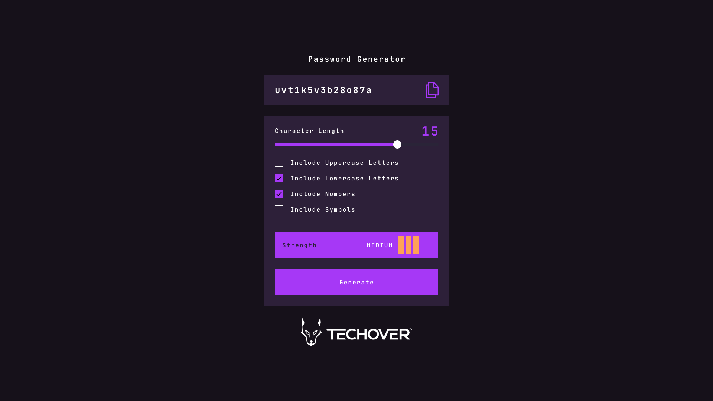

[Live Demo](https://password-generator.tobaunta.torkelsson.online)

## Password Generator

**Time for a challenge 🐺**

## What are you going to do?

Your challenge is to build out this password generator app and make it look as similar to the design as possible.

You can use whatever tools you want to help you complete the challenge. So if you have something you want to practice, feel free to try it.
Ex. TypeScript, React, sass 🔥

**Your users should be able**:

- Generate a password based on the selected inclusion options
- Copy the generated password to your computer's clipboard
- See a strength assessment for your generated password
- Show the optimal layout of the interface depending on its device's screen size
- See hover and focus state of all interactive elements on the page

## Step-By-Step Guide!

1. Start by creating a basic HTML page with the card that the user will be able to choose their password settings.

2. A slider to select the number of characters in the password

3. Checkboxes to choose which characters should be included in the password (uppercase letters, lowercase letters, numbers, special characters)

4. A "strength meter" to see how strong your password is.
5. A button to generate the password.

6. Use CSS to style the form and make it more user-friendly. Use CSS to mimic layout, colors, fonts, and padding.

7. Create a function in JavaScript to generate the password based on the user's selection. Use these to generate a random password.

8. Create another function in JavaScript to copy the generated password to the user's clipboard.

9. Create a function in JavaScript to calculate the strength of the generated password. This feature may use an algorithm that takes into account factors such as length and number of unique usage choices.

10. Use JavaScript to update the interface with the generated password and its strength assessment.

11. Add hover and focus states for all interactive elements on the page

12. Test and debug your password generator app to make sure everything is working as it should.

## How do you submit the task?

Throw together your HTML / CSS and Javscript file in a folder and make it a zip file. Which you then submit in this lesson at TSM.

## Good luck :)))
